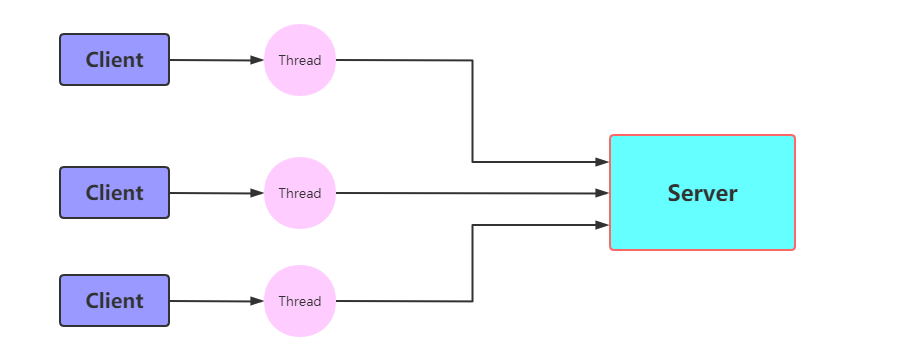
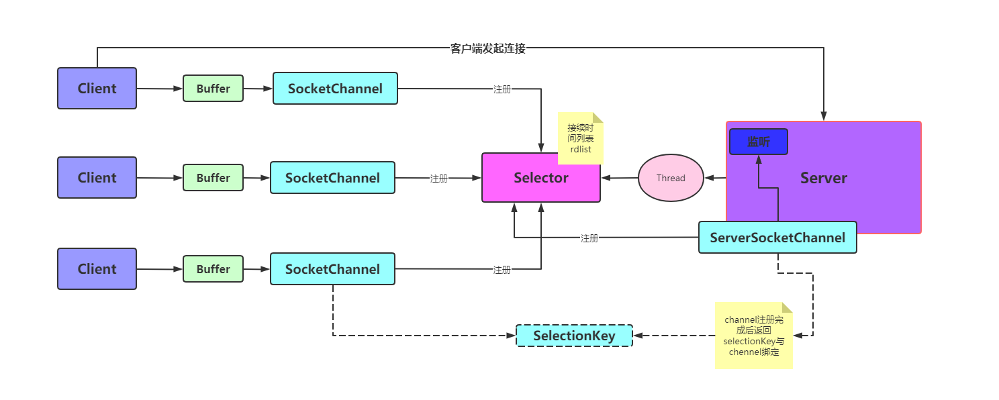

# Netty-分布式RPC解决方案

## IO模型

I/O输入/输出(Input/Output)，分为*IO*设备和*IO*接口两个部分。IO模型就是说用什么样的通道进行数据的发送和接受，java共支持三种网络IO模式：BIO、NIO、AIO。

## BIO NIO AIO详解

### BIO(Blocking IO) 同步阻塞

一个客户端连接对应的要有一个线程处理。



**缺点：**

1、bio代码中的read是阻塞操作，如果连接不做数据的读写操作就会导致整个线程阻塞，浪费资源。

2、从上图中我们可以发现，如何存在很多客户端进行io操作，就导致服务器线程开销太多，压力太大等问题，比如C10等。

**应用场景：**

BIO方式适用于连接数目录比较小且固定的架构，这种方式对服务器资源要求比较高，但程序简单易理解。

### NIO(Non Blocking IO) 同步非阻塞

NIO就是实现服务器一个线程可以处理多个请求,客户端发送的连接请求都会注册到**selector(多路复用器)**上，然后轮询selector中的IO请求进行处理。
**NIO核心API:**

```JAVA
//创建多路复用器
Selector.open()
//将channel注册到selector上
socketChannel.register(selector,SelectionKey.OP_ACCEPT)
//阻塞等待需要处理的事件
selector.select()
```


NIO方式适用于连接数目多且连接比较短的架构，比如聊天服务器，弹幕系统等

**总结：**

NIO整个调用流程就是java调用操作系统的内核函数来创建socket，获取到socket的文件描述符，再创建一个Selector对象，对应操作系统的Epoll描述符，将获取到的socket连接文件描述符的时间绑定到selector对象的Epoll文件描述符上，进行时间的异步通知，这样就实现了使用一个线程，并且不需要太多的无效遍历，将时间处理交给操作系统内核(操作系统中断程序实现)，大大提高效率。

### LINUX函数详解

**Epoll函数详解**

```c++
int epoll_create(int size);
```

创建一个epoll实例，并返回一个非负数作为文件描述，用于对epoll接口的所有后续调用。参数size代表可能会容纳size个描述符，但size不是一个最大值，只是提示操作系统它的数量级，当前这个参数基本上已经弃用了。

```c++
int epoll_ctl(int epfd,int op,int fd,struct epoll_event*event);
```

使用文件描述符epfd引用的epoll实例，对目标文件描述符fd执行op操作。

参数epfd表示epoll对应的文件描述符，参数fd表示socket对应的文件描述符。

参数op有以下几个值：

EPOLL_CTL_ADD：注册新的fd到epfd中，并关联事件event；

EPOLL_CTL_MOD：修改已经注册的fd的监听事件；

EPOLL_CTL_DEL：从epfd中移除fd，并且忽略掉绑定的event，这时event可以为null；

参数event是一个结构体

```c++
    struct epoll_event {
	    __uint32_t   events;      /* Epoll events */
	    epoll_data_t data;        /* User data variable */
	};
	
	typedef union epoll_data {
	    void        *ptr;
	    int          fd;
	    __uint32_t   u32;
	    __uint64_t   u64;
	} epoll_data_t;
```

events有很多可选值，这里只举例最常见的几个：

EPOLLIN ：表示对应的文件描述符是可读的；

EPOLLOUT：表示对应的文件描述符是可写的；

EPOLLERR：表示对应的文件描述符发生了错误；

成功则返回0，失败返回-1

```c++
int epoll_wait(int epfd, struct epoll_event *events, int maxevents, int timeout);
```

等待文件描述符epfd上的事件。

epfd是Epoll对应的文件描述符，events表示调用者有可用事件的集合，maxevents表示最多等到多少个时间久返回，timeout超时时间。

IO多路复用底层主要用的Linux内核函数(select,poll,epoll)来实现，Windows不支持epoll实现，Windows底层是基于windsock2的select函数实现的

|          |                  select                  |                   poll                   |                       epoll（>jdk1.5）                       |
| :------: | :--------------------------------------: | :--------------------------------------: | :----------------------------------------------------------: |
| 操作方法 |                   遍历                   |                   遍历                   |                             回调                             |
| 底层实现 |                   数组                   |                   链表                   |                            哈希表                            |
|  IO效率  | 每次调用都进行线性遍历，时间复杂度为O(N) | 每次调用都进行线性调用，时间复杂度为O(N) | 事件通知方式，每当有IO时间就绪系统注册的回调函数就会调用，时间复杂度为O(1) |
| 最大连接 |                  有上限                  |                  无上限                  |                            无上限                            |

### AIO 异步非阻塞

异步非阻塞， 由操作系统完成后回调通知服务端程序启动线程去处理， 一般适用于连接数较多且连接时间较长的应用

**IO模型对比**

|          | BIO      | NIO        | AIO        |
| -------- | -------- | ---------- | ---------- |
| IO模型   | 同步阻塞 | 同步非阻塞 | 异步非阻塞 |
| 编程难度 | 简单     | 复杂       | 复杂       |
| 可靠性   | 好       | 好         | 好         |
| 吞吐量   | 低       | 高         | 高         |


